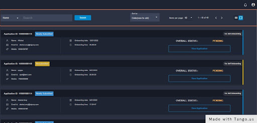

# 📦 All Applications

Under this section, all the applications are stored. In the highlighted section below, you can see a search bar where you can search the applications by name, email-ID, merchant ID, and application ID and sort the applications by new or old at your ease.

### View Application

After clicking on the view application, you come across some tabs. The number of tabs can be configurable. The number of tabs to show is configurable from the GO admin portal.
