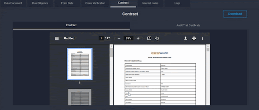

# Contract

Regardless of the size of the company, contracts and agreements play an important role in conducting business. In addition to being clear and specific, a contract must meet certain criteria in order to be legally enforceable. The contract is filled by the applicant and is provided with all the necessary documents. An audit trail is a step-by-step record that allows accounting details, trade details, or other financial information to be traced. Many types of transactions can be verified and tracked with audit trails, including accounting transactions and trades in brokerage accounts.

