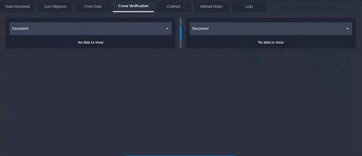

# Cross Verification

Document verification is the process of verifying the customers' identity by performing several authenticity checks on the customer-provided ID documents. AI-based document verification solutions help us to detect and eliminate the risk of fake identities and identity thefts. It is highly capable of analyzing minor signs of forgery or modification in a single pixel of the ID document. Document verification system checks the holograms, micro prints, fonts, and MRZ code. Customers can easily verify themselves by uploading the image of their ID documents such as ID cards or passports from their laptops or smartphones.Here, You can open the document (PAN, KRA, Risk Score etc) and compare these two documents manually.

