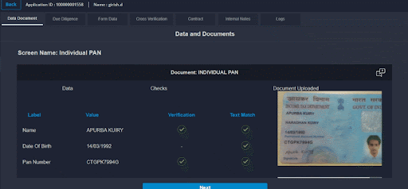

# Data Document

This section consists of the data and document(s) submitted during the journey. All the data and document images (and/or pdfs) from extraction and fetch widget pages show up here.

Certain API-based rules applied on the page(s) like text match & verification are also displayed here.

E.g. - PAN, OVDs like Aadhaar, Passport, Driving License, details fetched from sources like KRA, CKYC, etc. show up here in this section.

> The applicant’s data and documents that he/she provided while onboarding are shown. Also, these points can be configured in the Admin Portal's Backops section.

* PAN Card
* KRA (Key Result Area) Widget
* POA
* Bank Account Verification

