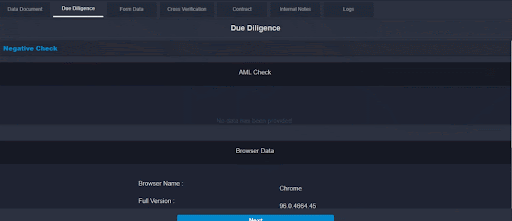

# Due Diligence

The aim is to ensure better valuation and risk mitigation. AML: Anti Money Laundering. In this step, it checks whether the applicant has participated in any offending activities or not. Browser Check: Provides information about the browser used by the applicant when onboarding.

