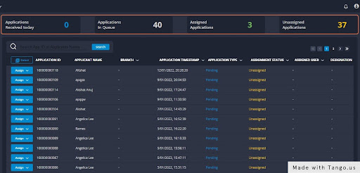
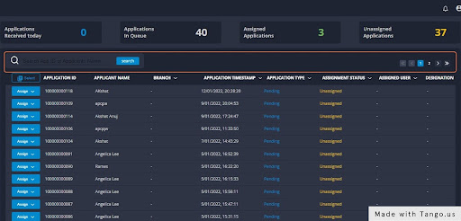
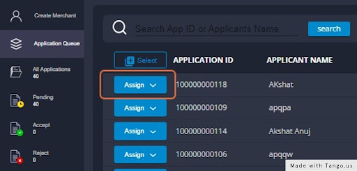

# 🧵 APPLICATION QUEUE

## Header

In this section you can see:

1\. Applications received that day

2\.  How many applications are in the queue&#x20;

3\. Applications assigned to the users

4\. The number of unassigned applications

## Search bar

You can search through the applications by typing the application ID or the applicant’s name. On the extreme right of the highlighted section below you can click on the arrow to move to the next page.

## Click on Assign

Click on Assign to assign a particular applicant to the backops user.

