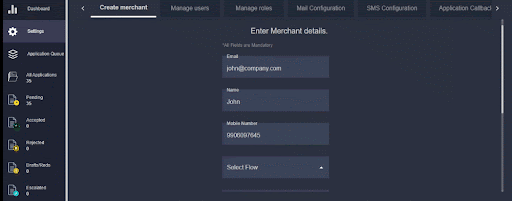

# 💼 Create Merchant

A merchant is basically an onboarding user.

&#x20;Employees of the bank can generate links for merchants to onboard, and these are sent to the merchant via mail or SMS.&#x20;

> With appropriate permissions, backops users can set up merchant accounts and send them the generated links so they can complete their onboarding process.

Once you have entered your details, you can create a merchant associated with a specific flow (This flow was created in the admin portal)

After selecting a flow, define the labels and select the options from the drop-down.
