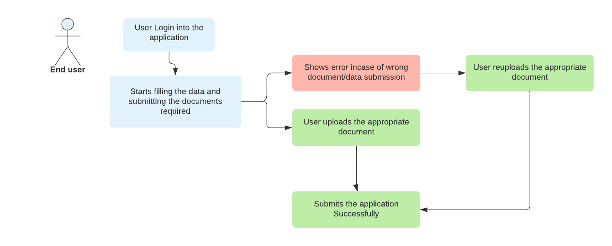

# 👩‍💼 Understanding the End User

## Who is the End User?

It is the person who will be onboarding via the login details provided over e-mail.

### In this,

The User Logs in to the application and starts filling in the details required and submitting the document to complete the application.&#x20;

> The User will be shown an error / asked to reupload in case of wrong data or document submission.

The User uploads the appropriate document and finally submits the application.

