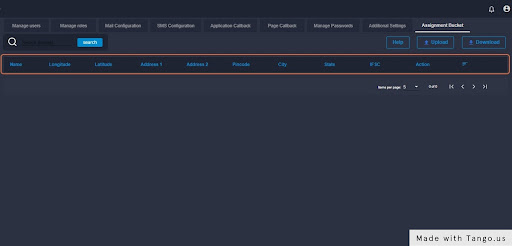

# Assignment Bucket(p)

Assignment strategy: The strategy based on which the application flowing into the backops post successful submission will be assigned to application auditors (backops users). Currently, GO supports 4 types of assignment strategies:

1\. Random - If the assignment strategy is set to 'Random', applications are randomly assigned to backops users.

2\. Fields - If the assignment strategy is set to 'Fields', applications are assigned on the basis of values returned by certain field(s) from the front end.

E.g. - Consider a merchant account onboarding use case. A merchant is categorized as high, medium, or low risk depending on the kind of business s/he is into. If the merchant is into a business that is categorized as high risk (e.g. - pawn shops, jewelry stores, antique businesses, etc), the application needs to undergo an audit by a risk team person. In this case, assignment happens on the basis of the risk assessment field present in the front end of the applicant's journey.

3\. Performance -  If the assignment strategy is set to 'Performance', applications are assigned on the basis of the performance of the backops user. (incomplete)

4\. Round Robin -  If the assignment strategy is set to 'Round Robin', applications are assigned on a round-robin strategy. In the round-robin strategy of allocation, the following steps are followed:

i. Backops users with the most and least number of applications are identified.

ii. The user with the least number of applications is then allotted applications till his/her count reaches the user with the following highest number of application allocations.

iii. Post this, the applications are allotted to users on a round-robin basis (one to A and next to B).

> Once all the backops users have an equal number of applications in their buckets, applications flow into their buckets one by one in equal order.

The following example will make it clear

Consider 4 Backops users A, B, C, and D.

A - 10 applications

B - 8 applications

C - 6 applications

D - 4 applications

Every new application which comes in will be allotted to D until it reaches the number of applications resting with C (6 in this case). Once this is achieved (i.e. both C and D have an equal number of applications in their bucket), the next highest is identified which is B (8) in this case. Now the applications will flow to C and D in a round-robin sequence till both of their buckets match B.

### **The header bar** 

Here, there will be a list that will contain the longitude, latitude, IFSC code, etc. of the applicants.

